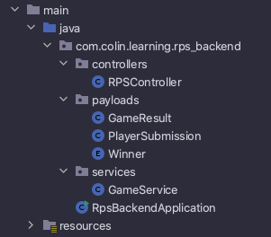
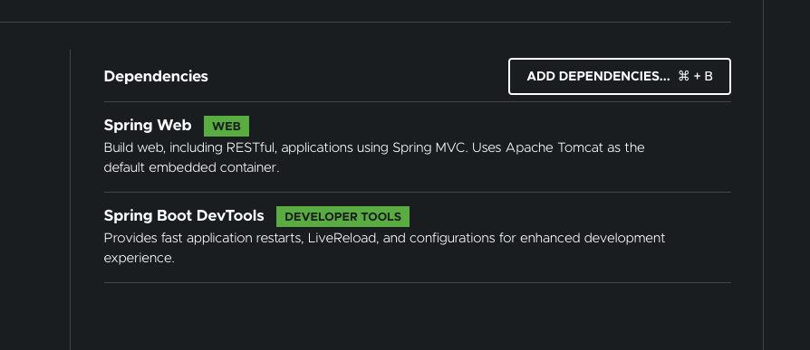

Welcome to part 2 of my adventures in over-complicating things! For an explanation of why, how and what, why not check out [part 1](/blog/rock-paper-scissors-1)?.

The story so far: Having decided what to use to make my rock-paper-scissors game, I'm about to start building it...

## Planning it all out
The Spring application won't be particularly complicated, but there will still be a few moving pieces which need to drop into place. The first one is the way in which front and back ends will communicate with each other. It's not just a question of *how*, though: we also need to think about *what* they need to send back and forth. In this example there won't be a whole lot to send: we'll need to let the back end know which option the player chose, then let the front end know the computer's choice and the result. 

We're going with a single route (`/play`) which the frontend will post the player's choice to and get back the computer's choice and the result. For now we don't care about tracking win streaks or logging any stats so there's no need for a database right now.

Handling the JSON going back and forth will require a couple of models to represent the payloads: one for the player's choice and another for the result. We'll also need a third model here which will handle the game logic for us.

By the end of this article our back end will look like this:



## Dependencies

Since we don't have a database to worry about, or any authentication, we only really need the Spring Web dependency. I'm going to add Spring Boot DevTools for some quality-of-life improvements, but that one's entirely optional.



## Building the payloads
Let's start by setting up the models to represent the input and the result. We'll create a payloads package and inside it two classes: `PlayerSubmission` and `GameResult`.

`PlayerSubmission` will take care of the user's input. There's a lot of information we could capture about our players, but the only thing we really need to know about is which option they chose. Will give our model a String property called `playerChoice` to store the information, add an empty constructor and the getter and setter, then we're done!

```java
// PlayerSubmission.java

public class PlayerSubmission {

    private String playerChoice;

    public PlayerSubmission() {
    }

    public String getPlayerChoice() {
        return playerChoice;
    }

    public void setPlayerChoice(String playerChoice) {
        this.playerChoice = playerChoice;
    }
}
```

The elephant in the room here is the default constructor - don't we need to pass in a `playerChoice` variable? Not in this case, since we're never going to be creating an instance of `PlayerSubmission`. All we need is a default constructor so the JSON we get from the front end can be deserialised, then we can use the setter to fill in the blanks.

Handling the result is a little more complicated (remember what I said about over-engineering things?). This time we're going to have two properties (`computerGuess` and `winner`), plus the associated getters and setters. This time we will need to instantiate the class so we'll provide a constructor:

```java
// GameResult.java

public class GameResult {

    private String computerGuess;
    private Winner winner;

    public GameResult(String computerGuess, Winner winner) {
        this.computerGuess = computerGuess;
        this.winner = winner;
    }

    public String getComputerGuess() {
        return computerGuess;
    }

    public void setComputerGuess(String computerGuess) {
        this.computerGuess = computerGuess;
    }

    public Winner getWinner() {
        return winner;
    }

    public void setWinner(Winner winner) {
        this.winner = winner;
    }
}
```

We could have just used a string to store the winner's details, but instead I've gone with an enum. Enums are great little tools, but are *very* easy to mis-use. Anywhere we need to restrict the available options would be a good situation to use them in, but it's also important that we won't need to add extra options down the line somewhere. Here we're only ever going to have three options (player wins, computer wins, draw) so we'll add a `Winner` enum to our payloads package.

```java
// Winner.java

public enum Winner {

    PLAYER,
    COMPUTER,
    DRAW

}
```

## Setting up the controller

If we want to play our game we're going to need some way of interacting with it. The user will be pressing buttons on our fancy(ish) Electron app so really what we need is an interface for *that* to interact with.

Enter the controller. Here we'll set up an endpoint for the front end to send the user's selection to and which will send back the result of the game. It won't be responsible for figuring out what that result should be, though. That will be the responsibility of a separate class which will handle the game logic for us. For now we need to create a new package for our controllers at the same level as our payloads package and create an `RPSController` file in it. 

```java
// RPSController.java

@Controller
public class RPSController {

}
```

The `@Controller` annotation is crucial here - without it our app won't know that the routes defined in here are to be meant to be visible for our users. We're only going to have one route which will enable our user to send their guess. We'll call the route `/play` and have it deserialise the JSON sent into a `PlayerSubmission` object. We need to send something back to the player to let them know what happened and we'll do that using a `ResponseEntity`. We could simply send back a `GameResult` object and the front end would still get the necessary information, but by using `ResponseEntity` we open up a world of extra functionality. Here, for example, we can specify the HTTP status code we send with our request.

```java
// RPSController.java

@Controller
public class RPSController {

    @PostMapping("/play")
    public ResponseEntity<GameResult> getComputerGuess(@RequestBody PlayerSubmission playerSubmission){
        
        // we'll define result soon...

        return new ResponseEntity<>(result, HttpStatus.OK);
    }

}
```

The annotation above the method name defines two things: the route we're making available and the type of request it will accept. It might seem strange to be making a POST request; we're trying to get the result of our game, so surely we want to use a GET request? The issue comes from the need to submit the player's guess. Sending a request body is blocked when making a GET request as it's supposed to be a safe method, meaning a GET request shouldn't include anything which could modify the application receiving it in any way. We could use any of the "unsafe" methods to send our data, but each implies something different about our objective. We're not updating or deleting anything, we're sending something new, so POST is the appropriate method here.

The other new thing here is the `@RequestBody` annotation. There are different ways of transferring data when making an HTTP request, one of which is to submit it in the body of the request. By adding this annotation to one (or more) of the method's parameters we can say that it can be found by deserialising the body of the request using the specified type as a template. In this case we'll use our `PlayerSubmission` class from earlier.

There's one more step here, but it's a fairly big one - we need to figure out who won! We could put the logic behind that inside the body of the `getComputerGuess` method but that would be a bad decision from a design perspective. It's a little contrived in our example (what else are we going to use this logic for?) but in general we want to keep our code as reusable as possible. That means breaking it down into smaller pieces which can be plugged in wherever they're needed. If our code is inside the method, only that method can use it. Instead we'll put the game logic in a separate class and import it into this one.

Create another package called "services" and a class called `GameService` inside there. We'll flesh that out in the next post, for now we'll add the code to `RPSController` to make it available.

```java
// RPSController.java

@Controller
public class RPSController {

    @Autowired
    GameService gameService;

    @PostMapping("/play")
    public ResponseEntity<GameResult> getComputerGuess(@RequestBody PlayerSubmission playerSubmission){
        
        // we'll define result soon...

        return new ResponseEntity<>(result, HttpStatus.OK);
    }

}
```

The `@Autowired` annotation tells Spring to create and manage an instance of `GameService` for us which will be available for any method in `RPSController` to use. The key difference to just writing the code here, though, is that *any* part of our app could autowire a `GameService` if needed. Only certain things can be autowired though - more on that next time...


## Next steps

We've got the bare bones of our app set up here: we could fire it up and our users could make a post request to the `/play` route, we just couldn't do anything with the information they send. In the next post we'll add the game logic and make our back end play the game, then in future posts we'll make it a bit easier to interact with it by adding a proper front end.